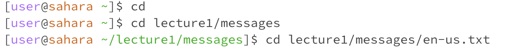
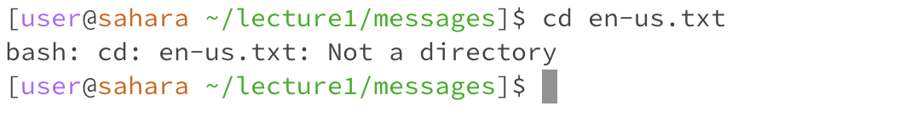
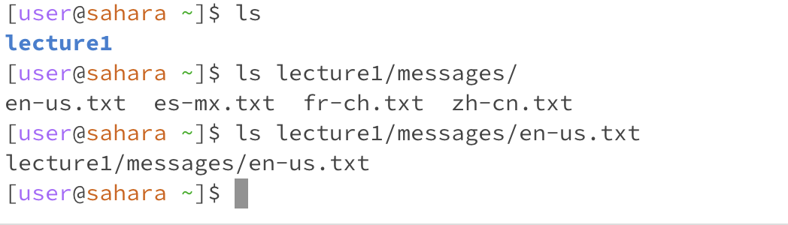
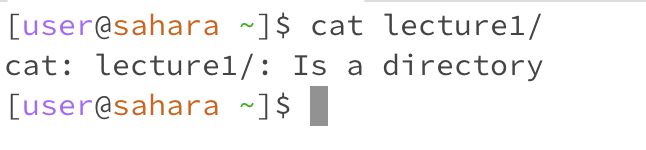
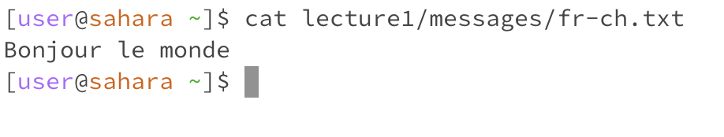

# Lab Report 1
*The file system used is lecture one file directory cloned from "https://github.com/ucsd-cse15l-f23/lecture1"*

The root directory is Lecture1. It contains Hello.class, Hello.java, README, and the messages directory.
The messages directory contains en-us.txt, es-mx.txt, fr-ch.txt, and zh-cn.txt files that demonstrate 'hello world' in different languages.
***
## Using "cd" command
* No arguments and directory as an argument

  - In the first command line, I used the change directory command ("cd") on the home directory without giving a path for a new directory. Thus, no change happened, and the terminal remained in the same directory.
  - In the second command line, I used the change directory command ("cd") to move from the home directory to the messages directory. Therefore, the terminal changed the current working directory to the messages directory _[user@sahara ~/lecture1/messages]$_ 
* File as an argument

  - I tried to change the directory from the messages directory to the en-us.txt file. An error message appeared "bash: cd: en-us.txt: Not a directory."
  - I concluded that the cd command will not work with a given file argument because it is not a directory.
  - After the error message, the second command line appeared in the messages directory, so no change occurred.
## Using "ls" command

- No arguments
  - Since ls lists all the files and directories in the current directory, I used ls on the home directory. The output was a list showing the Lecture1 directory (the only directory/file that exists in the home directory)
- Directory as an argument
  - Currently, the command line is working on the home directory. I used the ls command and passed a path to the messages directory as an argument. The output printed a list of all the files in the messages directory.  
- File as an argument
  - Currently, the command line is working on the home directory. I used the ls command and passed a path to the "en-us.txt" file in the messages directory. The output printed a path to the "en-us.txt" file from the home directory. 
## Using "cat" command

- No arguments
  - The "cat" command was executed on the home directory. The output was blank, but no error showed. 

- Directory as an argument
  - In the home directory, I passed "lecture1" directory as an argument to the "cat" command. An error statement emerged "cat: lecture1/: Is a directory". Thus, we can conclude that the "cat" command can not run on a directory.  

-File as an argument
  -In the home directory, I passed "fr-ch.txt" file as an argument to the "cat" command. No error statement was shown. Instead, the contents of the file was printed on the screen. 

