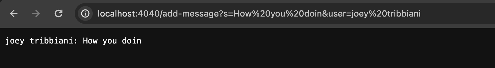

# Lab Report 2
## part 1
### Using valid queries

### Using invalid queries

## part 2
### Absolut path to private key

### Absolut path to public key

### Accessing ieng6 account without passcode

## part 3
I didn't know how to create a Java web server using HTTP. Therefore, the number, search, and chat server showed me how to implement the server class with custom requests by utilizing getPath(), getQuery(), and split methods.
