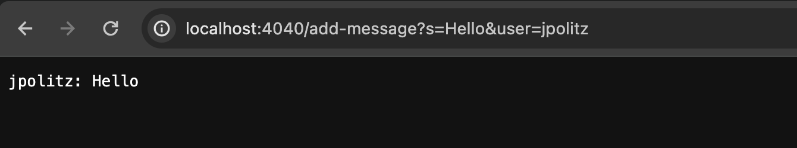
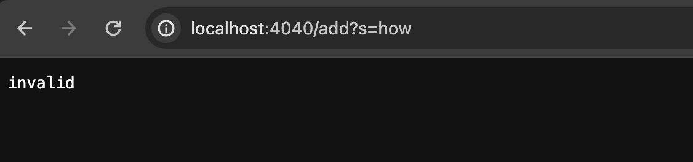
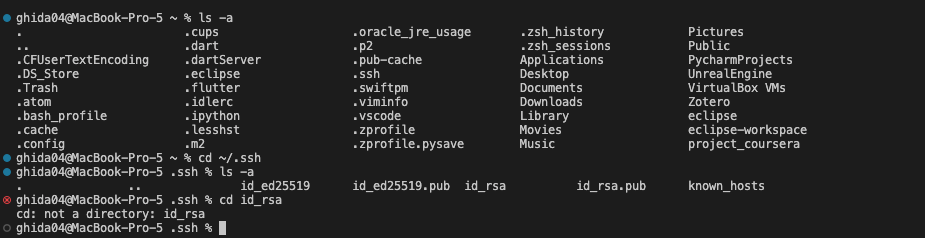
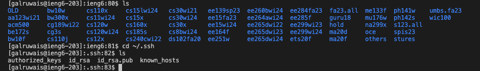
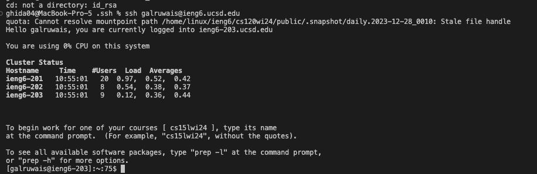

# Lab Report 2
## part 1
The server is constructed using the Server class used in the lab. Therefore, the main method works the same with valid/invalid arguments. The main method constructs the server on the local machine using the port number given to the terminal. The terminal will start the server after compiling and providing a port number. After the terminal starts the server we are provided with an alert "server started", then we can open the web server from the local machine by using localhost:4040 (port). The following chat commands will be written directly in the search bar using paths and queries. 
### Using valid queries

- After the port number we can specify a custom path that the handleRequest method will use to make requests like printing a conversation.
- The path specified was /add-message? which alerts the method that the following components of the URL will be a query.
- Then a segment method will take in the URL and segment the URL after the query into user and message variables.
- The segment method will return a string with the user and message variables in \[user: message] format.
- No values of relevant fields are changed from the segment method because it takes in the URL and uses .getQuery() and .split() methods to find the user/message without affecting the URL.
### Using invalid queries

- After the port number we can specify a custom path that the handleRequest method will use to make requests like printing a conversation.
- If the path is unrecognized in the HandleRequest method it will return invalid
- If the path is recognized it will be sent to the segment method.
- The segment method will return invalid if the user/message variables do not exist in the URL.
- In the server snippet above, the path was unrecognized as it was "add?" not "add-message?". Thus, it directly returned invalid without calling the segment method.
- The handleRequest method does not change any fields because it just detects if the URL has a recognized path, and a correct syntax for the query, and then sends the URL into the segment method.
- No values of relevant fields are changed from the segment method because it takes in the URL and uses .getQuery() and .split() methods to find the user/message without changing the URL.
## part 2
### Absolut path to private key

### Absolut path to public key

### Accessing ieng6 account without passcode

## part 3
I didn't know how to create a Java web server using HTTP. Therefore, the number, search, and chat server showed me how to implement the server class with custom requests by utilizing getPath(), getQuery(), and split methods.
