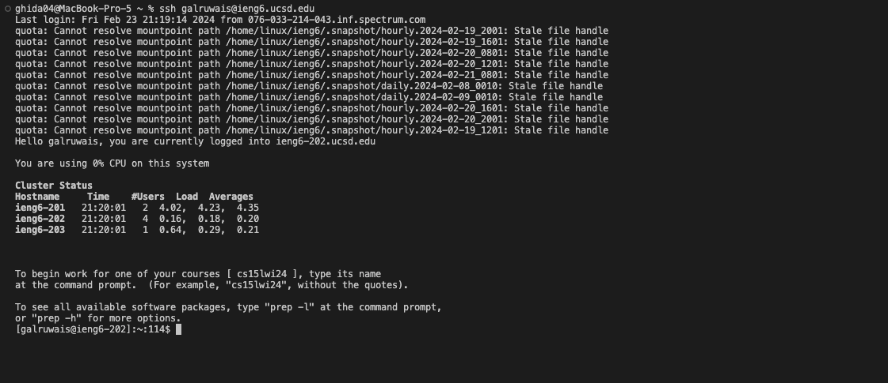
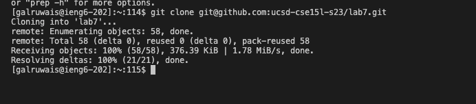
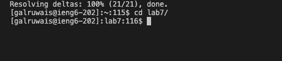
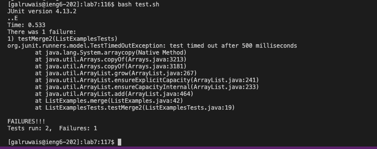
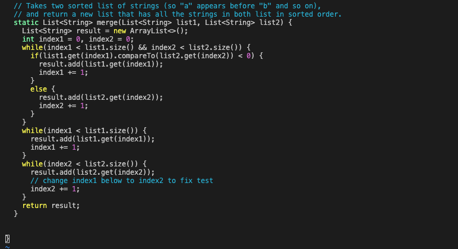
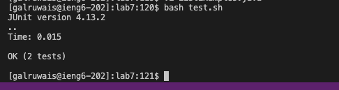
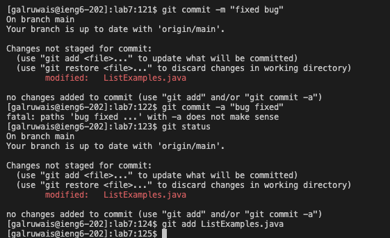
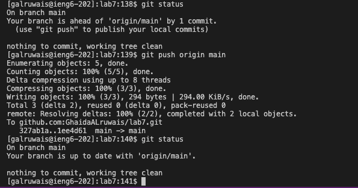

# Lab Report 4
## Step 4: logging to ieng6

no speed up commands were used.
## Step 5: cloning the fork of the repository


- I copied ssh of the repository from copy button in github
- Then ```command-v``` to paste the ssh url after git clone
- cd into lab7 by typing cd l then ```<tab><enter>```

- I wrote bash t
- Then used ```<tab>``` to autofill the name of the bash script that run the tests ```test.sh```


- wrote ```vi L``` then ```<tab>```
- it autofilled till ```ListExamples``` so i wrote ```.java``` then ```<enter>```
- the window above showed. i used ```i``` to go in insert mode
- Fixed the bug then ```:wq``` to save and quit the vim insert mode

- ```<tab> <tab>``` to go above two lines to the previous code in step 6
- ```<enter>```



