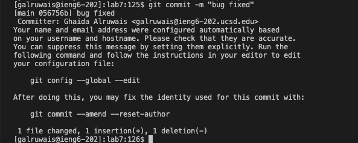

# Lab Report 4
## Step 4: logging to ieng6


no speed up commands were used.

## Step 5: cloning the fork of the repository


- I copied ssh of the repository from copy button in github
- Then ```command-v``` to paste the ssh url after git clone
- cd into lab7 by typing cd l then ```<tab><enter>``` to autofill lab7

## Step 6: Running tests


- I wrote ```bash t```
- Then used ```<tab>``` to autofill the name of the bash script that run the tests ```test.sh```

## Step 7: Editing ListExamples.java


- wrote ```vi L``` then ```<tab>```
- it autofilled till ```ListExamples``` so i wrote ```.java``` then ```<enter>```
- the window above showed. i used ```i``` to go in insert mode
- Then navigated using ```arrow down``` till the line that contains index1
- Then changed 1 to 2, Then ```ESC``` to go out of insert mode
- After fixing the bug, i used ```:wq``` to save the changes made and quit the vim insert mode

## Step 8: Running tests
  

- ```<up> <up>``` to go above two lines to the previous code in step 6
- ```<enter>``` to compile and check the tests again.

## Step 9: commit and push changes




- Tried to commit directly without adding ```LinkedList.java``` first so it didn't work
- Then typed git add L ```<tab>``` and it automatically filled ListExamples.java ```<enter>```
- Then typed ```<up><up>``` to go above to the failed commit and then i fixed the comment to "bug fixed" then```<enter>```
- checked current git status
- Then types git push o ```<tab><enter>``` and pushed current changes to remote directory
- Then checked current git status again by ```<up><up>``` it showed that im up to date with the remote version.
