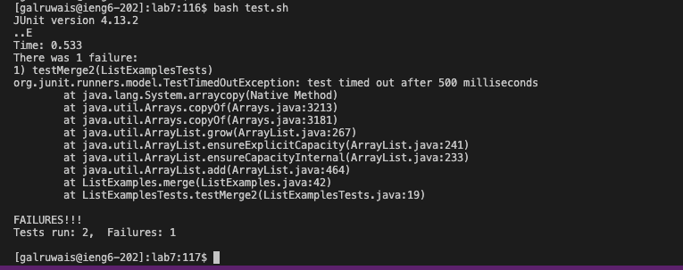
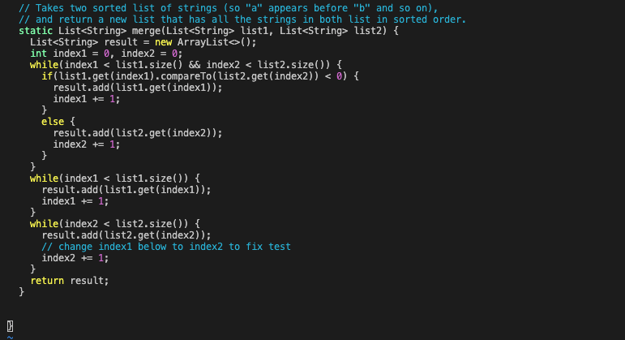
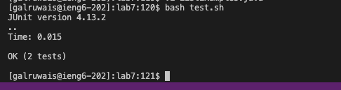

# Lab Report 5
I will be working on the lab7 directory: 

```
lab7
  ListExamples.java
  ListExamplesTests.java
  test.sh
  lib
    hamcrest-core-1.3.jar
    junit-4.13.2.jar
```

- ListExamples.java file:
  ```
  import java.util.ArrayList;
  import java.util.List;
  
  interface StringChecker { boolean checkString(String s); }
  
  class ListExamples {
  
    // Returns a new list that has all the elements of the input list for which
    // the StringChecker returns true, and not the elements that return false, in
    // the same order they appeared in the input list;
    static List<String> filter(List<String> list, StringChecker sc) {
      List<String> result = new ArrayList<>();
      for(String s: list) {
        if(sc.checkString(s)) {
          result.add(0, s);
        }
      }
      return result;
    }
  
  
    // Takes two sorted list of strings (so "a" appears before "b" and so on),
    // and return a new list that has all the strings in both list in sorted order.
    static List<String> merge(List<String> list1, List<String> list2) {
      List<String> result = new ArrayList<>();
      int index1 = 0, index2 = 0;
      while(index1 < list1.size() && index2 < list2.size()) {
        if(list1.get(index1).compareTo(list2.get(index2)) < 0) {
          result.add(list1.get(index1));
          index1 += 1;
        }
        else {
          result.add(list2.get(index2));
          index2 += 1;
        }
      }
      while(index1 < list1.size()) {
        result.add(list1.get(index1));
        index1 += 1;
      }
      while(index2 < list2.size()) {
        result.add(list2.get(index2));
        index1 += 1;
      }
      return result;
    }
  
  
  }
  ```
- ListExamplesTests.java file:
  ```
  import static org.junit.Assert.*;
  import org.junit.*;
  import java.util.*;
  import java.util.ArrayList;
  
  
  public class ListExamplesTests {
  	@Test(timeout = 500)
  	public void testMerge1() {
      		List<String> l1 = new ArrayList<String>(Arrays.asList("x", "y"));
  		List<String> l2 = new ArrayList<String>(Arrays.asList("a", "b"));
  		assertArrayEquals(new String[]{ "a", "b", "x", "y"}, ListExamples.merge(l1, l2).toArray());
  	}
  	
  	@Test(timeout = 500)
          public void testMerge2() {
  		List<String> l1 = new ArrayList<String>(Arrays.asList("a", "b", "c"));
  		List<String> l2 = new ArrayList<String>(Arrays.asList("c", "d", "e"));
  		assertArrayEquals(new String[]{ "a", "b", "c", "c", "d", "e" }, ListExamples.merge(l1, l2).toArray());
          }
  
  }
  ```
- test.sh file:

  ```
  javac -cp .:lib/hamcrest-core-1.3.jar:lib/junit-4.13.2.jar *.java
  java -cp .:lib/hamcrest-core-1.3.jar:lib/junit-4.13.2.jar org.junit.runner.JUnitCore TestListExamples
  ```

## The symptom



- The program is failing at merge2 test, which has the case in which the first element in list2 > list1.
## Response

- When list2 > list1 it will execute the if block in the first while loop, and add all the elements in the first list first
- It will not execute the second while loop and it will directly go to the third while loop
- The error must be in the third while loop.
- You can use print statements in the third while loop to check the variables 
## Fixed bug




- After writing print statement i realized that i was using index1 instead of index2
- Thus this while loop will not terminate because index2 will never be >= list2.size()
- How would this affect merge2 test?
  - The merge2 test has a timeout that will terminate the test after 500.
  - The symptom shown is the termination error due to infinite time loop that exceeded 500
    
## Reflection
Learning jdb and command line debugging has helped me the most this quarter. Not only with Cse 15l content, It helped me in Cse 12 Programming Assignments. Especially in the while loop part, jdb helped me to keep track of each time the loop executes and what might be the error, for example, it shows if the right and left instance variables of each node in the tree is assigned correctly.
